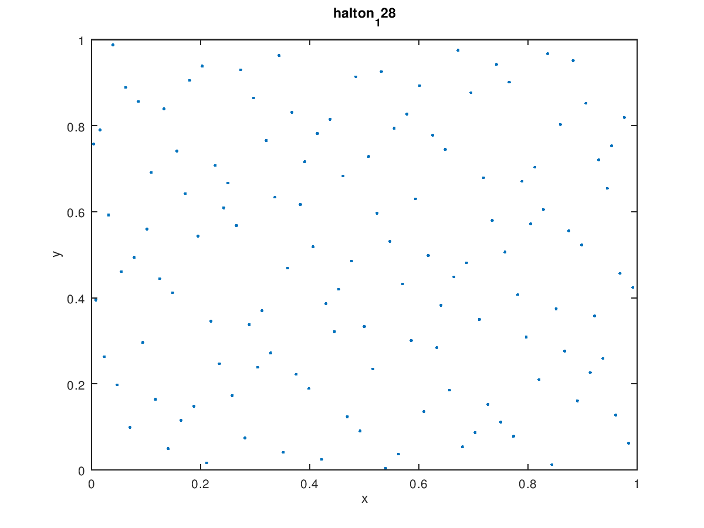
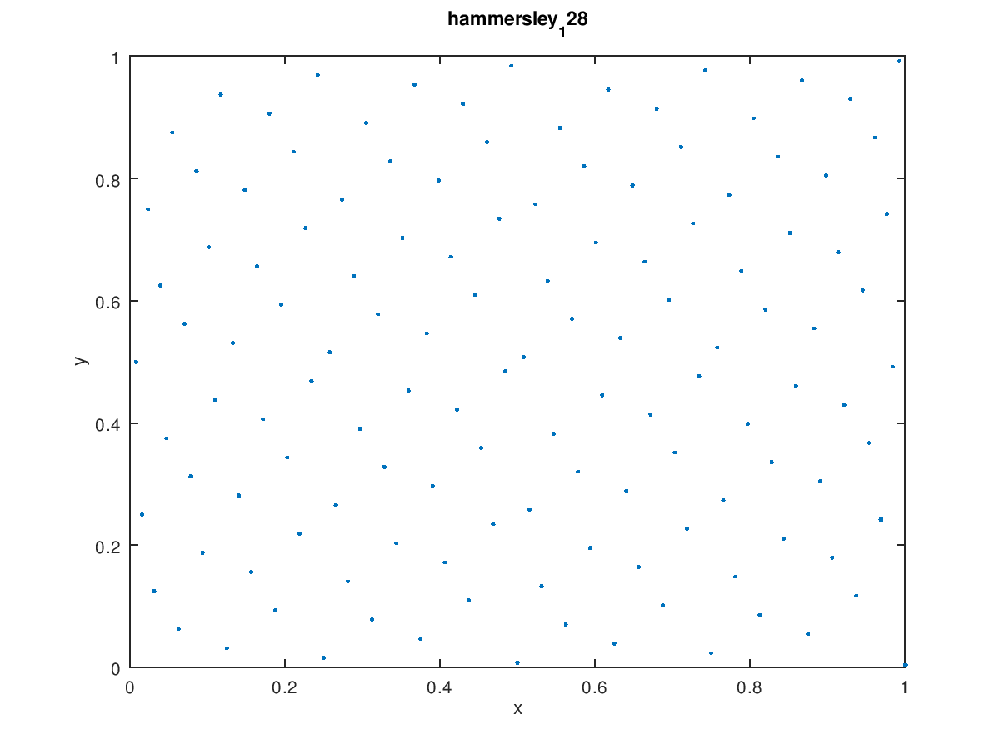
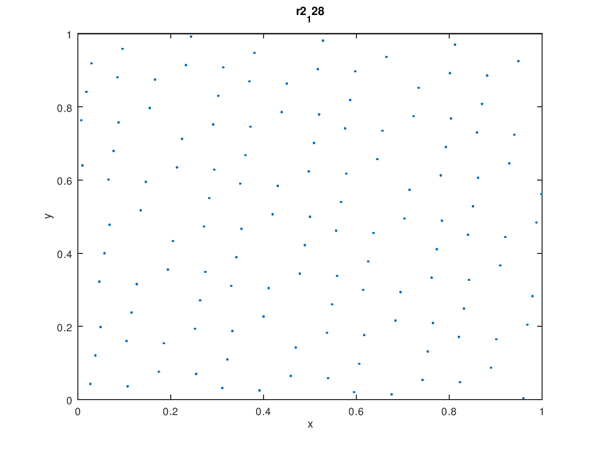
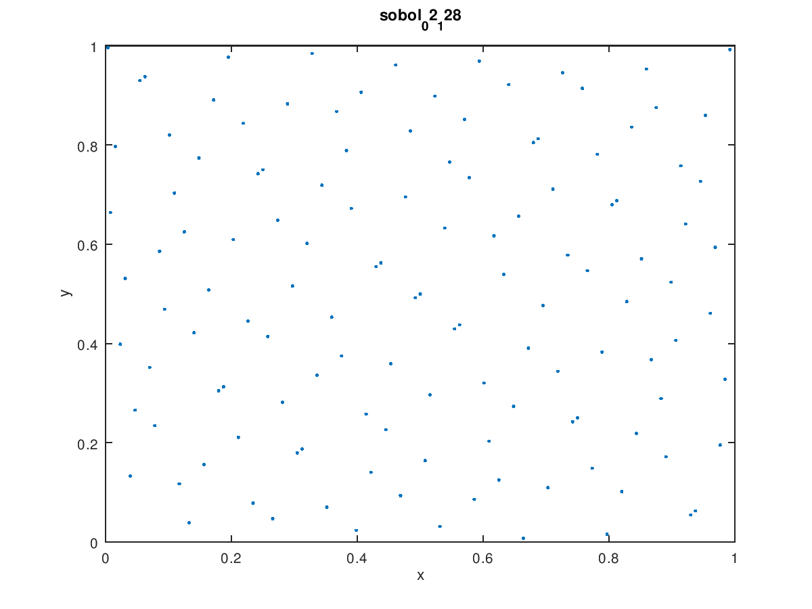
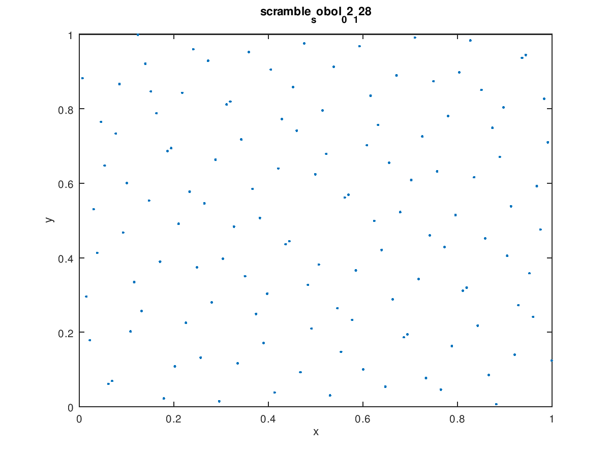
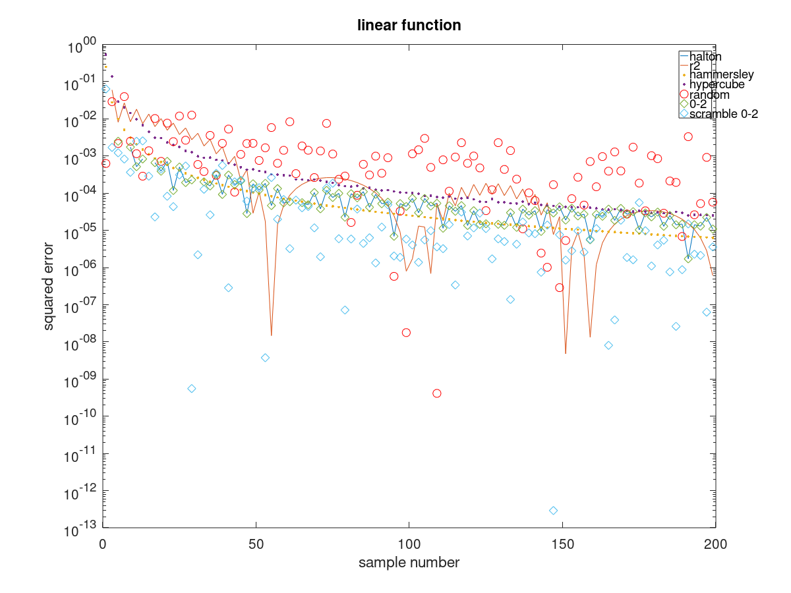
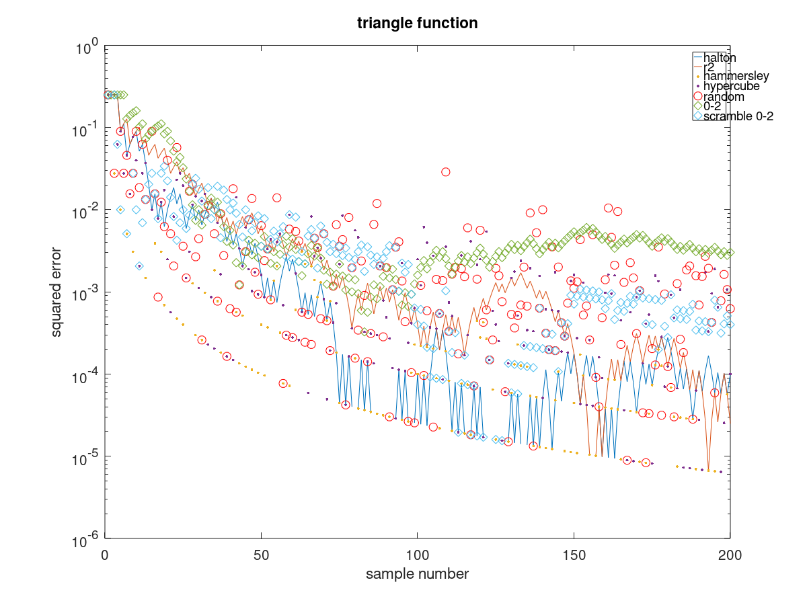
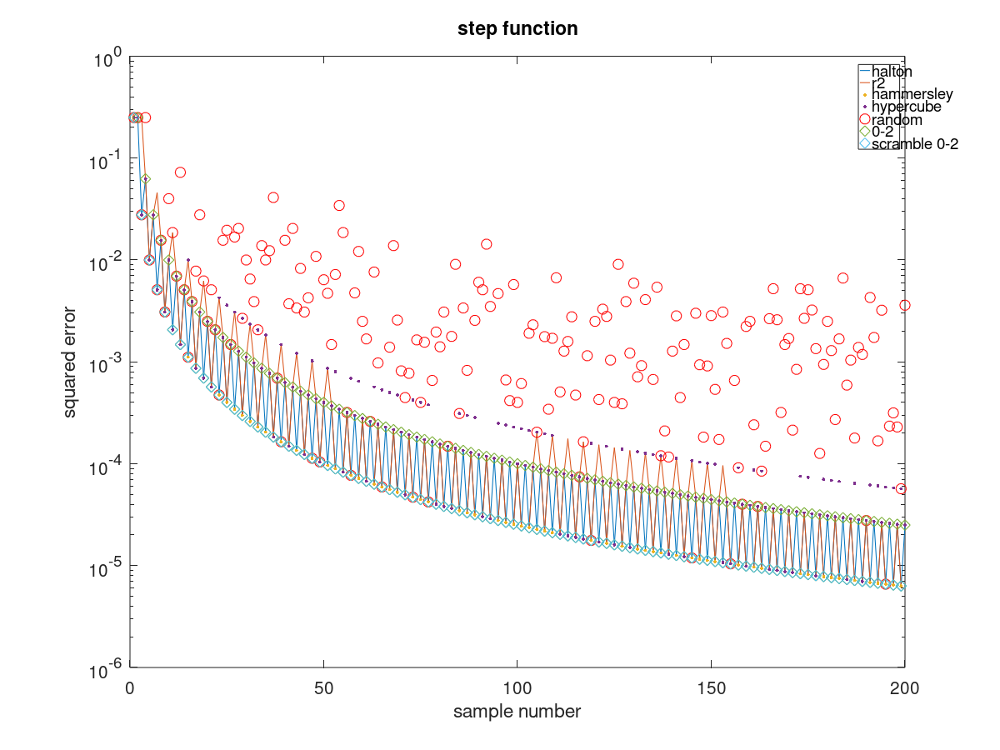
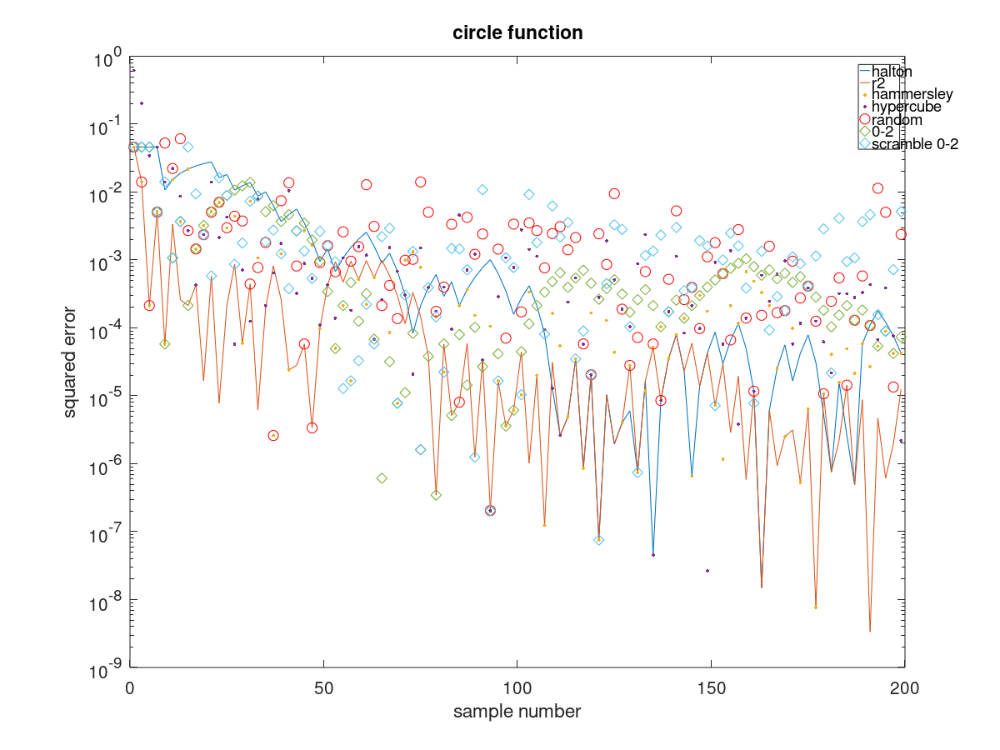

# Narukami
lightweight PBRT-style path tracer

# Experiment Data

## some 2D LDS  distribution for first 128 sample

## square integration error for some LDS

# Todo list
 - [x] element math 
 - [x] vector math
 - [x] matrix math
    - [x] SSE general inverse
 - [x] transform structure
 - [x] basic/SoA ray structure
 - [x] basic/SoA triangle structure (one vertex with two edge vector)
 - [x] intersect func for ray and SoA triangle(single ray with four triangle)
 - [ ] partial differential dpdu/dpdv for triangle
 - [x] basic rect structure 
 - [x] basic/SoA AABB structure(for QBVH) and intersect scheme
 - [x] basic spectrum structure
 - [x] basic triangle mesh structure 
    - [ ] read obj model 
 - [ ] basic path tracing framework
 - [ ] basic image i/o 
    - [x] write PNG
    - [ ] read PNG
 - [ ] basic film structure
 - [x] sampling methods
    - [x] stratified sampling method
    - [x] Halton sampling method
    - [x] Hammersley method 
    - [x] Sobel sampling method
    - [x] R2 sampling method
    - [x] compare their integration error
 - [x] Sobol 02 sampler (it's a (0,2)-sequence,so no max spp limit)
    - [x] 1D/2D sample component
    - [x] 1D/2D sample array 
 - [ ] basic SPD 
 
# Reference
[Physically Based Rendering](https://www.pbrt.org/)

[Embree](https://embree.github.io/)

[Mitsuba renderer](https://www.mitsuba-renderer.org/)

[The Unreasonable Effectiveness of Quasirandom Sequences](http://extremelearning.com.au/unreasonable-effectiveness-of-quasirandom-sequences/)
